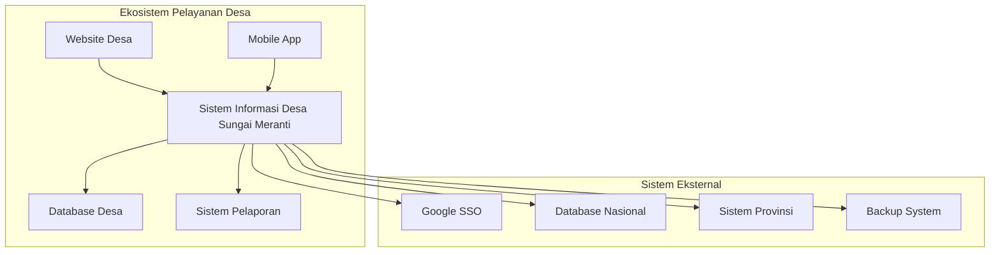
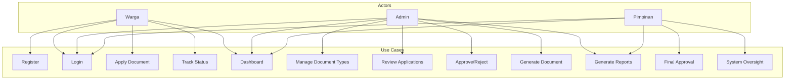
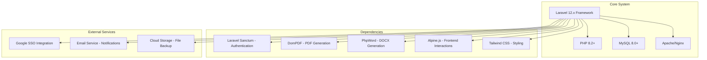
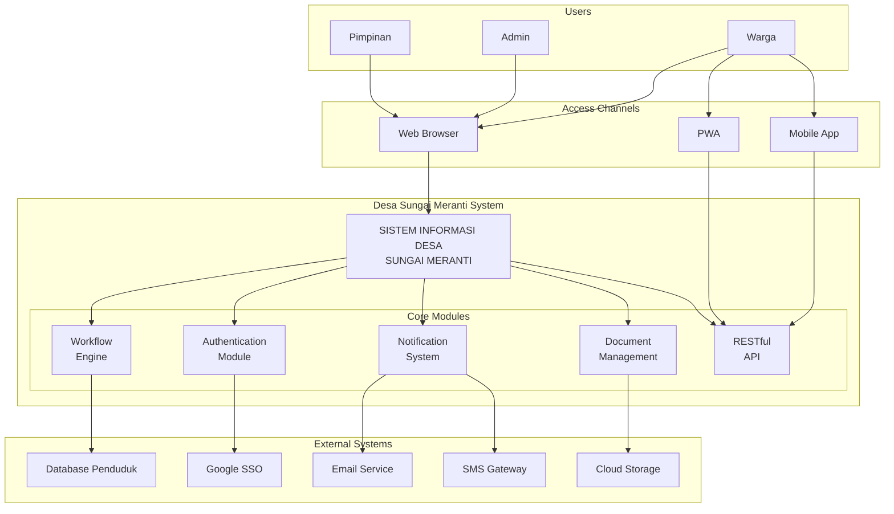
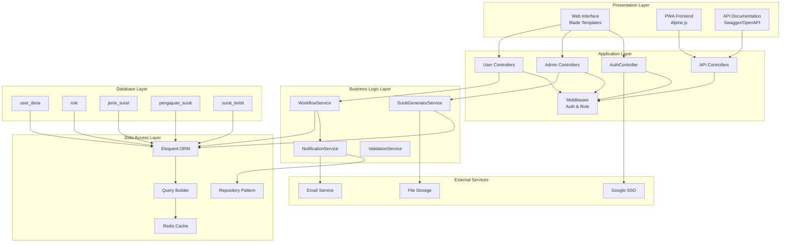
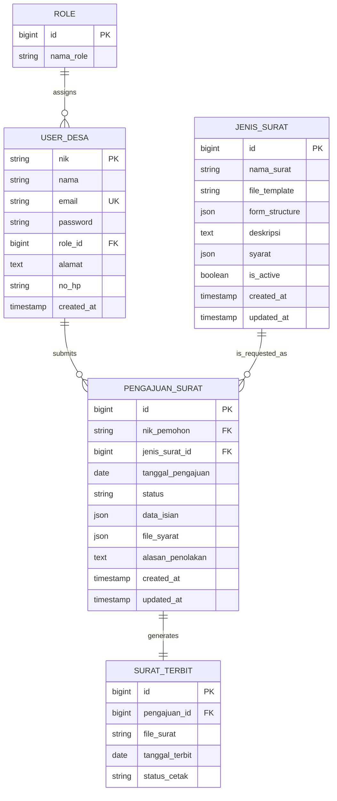
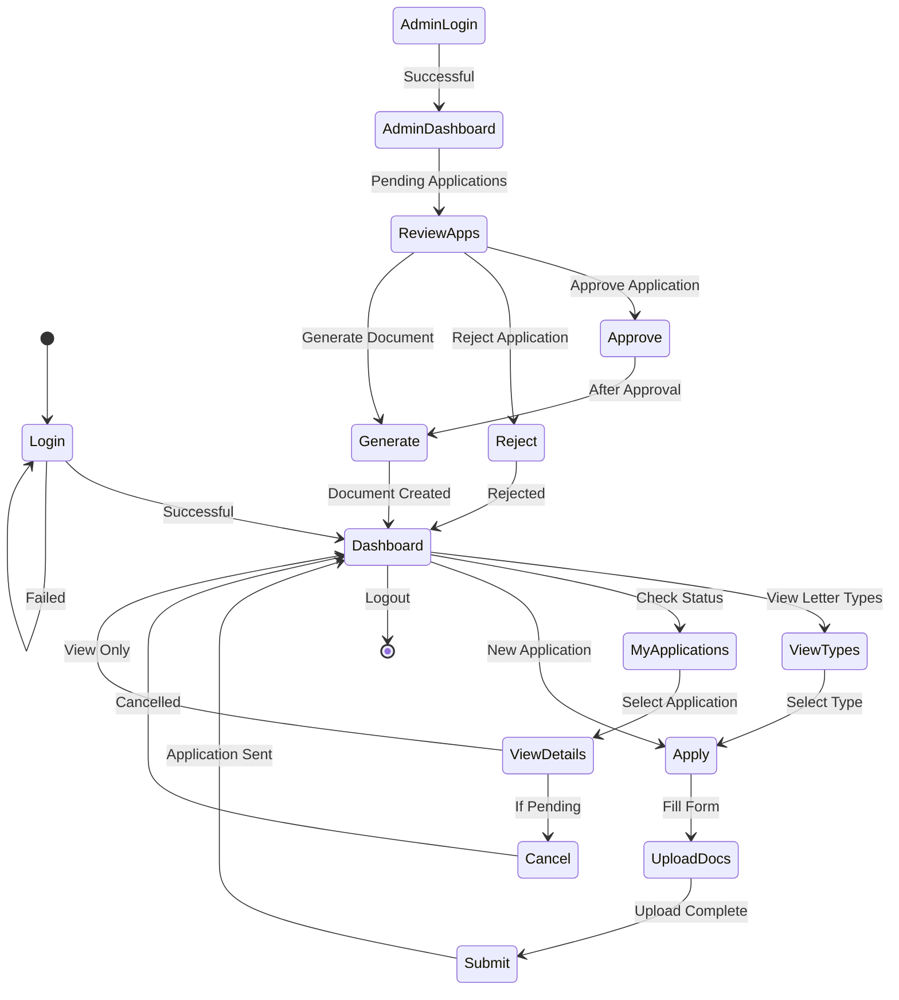
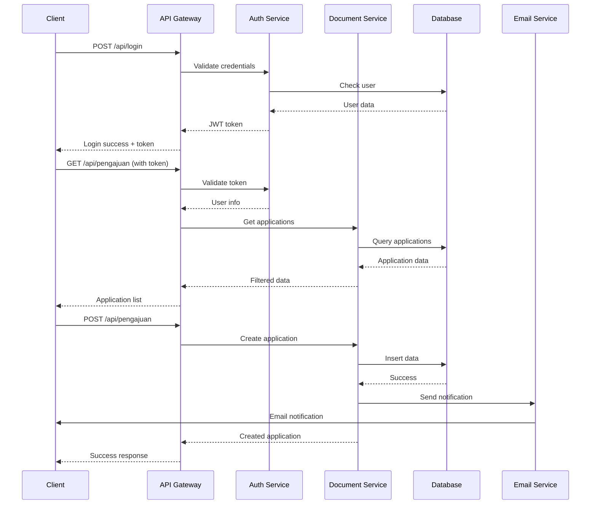

# Software Requirements Specification (SRS)
# Sistem Informasi Administrasi Desa Sungai Meranti

**Versi**: 1.0  
**Tanggal**: 7 November 2025  
**Proyek**: Desa Sungai Meranti - Sistem Informasi Administrasi Desa  
**Lokasi**: Kabupaten Bengkalis, Provinsi Riau  
**Platform**: Web Application dengan API Mobile

---

## 1. Deskripsi Produk

### 1.1 Posisi Sistem dalam Konteks

Sistem Informasi Administrasi Desa Sungai Meranti adalah platform digital modern yang beroperasi dalam ekosistem pelayanan publik desa. Sistem ini berfungsi sebagai inti dari proses digitalisasi administrasi desa, yang terintegrasi dengan sistem otoritasi pemerintah dan layanannya.



### 1.2 Deskripsi Umum

Sistem ini merupakan aplikasi web responsif yang menyediakan layanan administrasi desa secara digital, dengan fokus utama pada pengurusan dokumen dan surat-surat administratif. Platform ini dirancang khusus untuk Desa Sungai Meranti dengan kebutuhan spesifik pelayanan masyarakat modern yang terintegrasi.

### 1.3 Karakteristik Utama

- **Digital-First Approach**: Semua proses administrasi dilakukan secara digital
- **Multi-Platform Access**: Dapat diakses melalui web browser dan mobile devices
- **Real-time Processing**: Status pengajuan dan tracking real-time
- **Template-Based Document Generation**: Automatic document generation dari template
- **Role-Based Access Control**: Akses yang terbatas sesuai peran pengguna

---

## 2. Fungsi Produk

### 2.1 Fungsi Utama Sistem

#### 2.1.1 Fungsi Satu: Manajemen Autentikasi dan Otorisasi
**Deskripsi**: Sistem menyediakan mekanisme keamanan berlapis untuk mengakses sistem denganvalidasi identitas pengguna dan pengendalian akses berdasarkan peran.

**Fitur yang termasuk**:
- Pendaftaran pengguna baru dengan validasi NIK 16 digit
- Login/Logout dengan sistem email dan password
- Session management untuk keamanan
- Role-based access control (Admin/Warga)
- Password reset mechanism
- Google SSO integration

#### 2.1.2 Fungsi Dua: Sistem Pengajuan Dokumen Administrasi
**Deskripsi**: Platform komprehensif untuk mengajukan, memproses, dan mengelola berbagai jenis surat dan dokumen administratif desa.

**Fitur yang termasuk**:
- Pengajuan berbagai jenis surat (SKCK, Surat Keterangan, dll)
- Upload dan validasi dokumen persyaratan
- Form dinamis berdasarkan jenis surat
- Sistem tracking dan monitoring status
- Workflow approval untuk admin
- Notifikasi real-time

#### 2.1.3 Fungsi Tiga: Manajemen Template dan Generasi Dokumen
**Deskripsi**: Sistem untuk mengelola template surat dan menggenerasikan dokumen final dengan format yang konsisten.

**Fitur yang termasuk**:
- CRUD operasi untuk jenis surat dan template
- Dynamic form structure configuration
- Automatic document generation dari template
- PDF dan DOCX output generation
- Document versioning dan backup

#### 2.1.4 Fungsi Empat: Dashboard dan Pelaporan
**Deskripsi**: Interface analitik untuk monitoring, pelaporan, dan manajemen operasional sistem.

**Fitur yang termasuk**:
- Dashboard real-time untuk admin dan warga
- Statistik pengajuan dan approval rate
- Recent activity monitoring
- Report generation untuk analisis
- Data export functionality

---

## 3. Pengguna

### 3.1 Tipe Pengguna (Actor)

#### 3.1.1 Pegawai (Warga)
**Definisi**: Masyarakat umum yang berdomisili di Desa Sungai Meranti yang membutuhkan layanan administrasi desa.

**Karakteristik**:
- **Kemampuan Teknis**: Komputer dasar - mampu menggunakan web browser, upload file, mengisi form
- **Perangkat**: Smartphone, tablet, laptop, desktop
- **Akses Internet**: Stabil dengan bandwidth minimal 2 Mbps
- **Usia**: 17-65 tahun (dengan variasi kemampuan teknologi)
- **Bahasa**: Bahasa Indonesia (primary), dialects lokal
- **Kebutuhan Utama**:
  - Pengurusan surat secara mudah dan cepat
  - Tracking status pengajuan real-time
  - Notifikasi status updates
  - Akses 24/7 tanpa harus datang ke kantor desa

#### 3.1.2 Bendahara
**Definisi**: Pegawai bendahara di lingkungan pemerintah desa yang bertanggung jawab atas verifikasi dan persetujuan dokumen administratif.

**Karakteristik**:
- **Kemampuan Teknis**: Intermediate - familiar dengan sistem office, email, basic database operations
- **Tugas Spesifik**:
  - Review dan verifikasi pengajuan dokumen
  - Approval/rejection dengan reason
  - Generate dokumen final
  - Coordination dengan pulang kantor desa
- **Akses Sistem**: Full admin access untuk workflow approval
- **Kebutuhan Khusus**:
  - Bulk processing capabilities
  - Audit trail dan logging
  - Integration dengan sistem keuangan desa
  - Report generation untuk periodik

#### 3.1.3 Pimpinan
**Definisi**: pimpinan unit di lingkungan pemerintah desa yang memiliki otoritas final untuk persetujuan dokumen penting.

**Karakteristik**:
- **Kemampuan Teknis**: Basic to intermediate - familiar dengan email dan basic computer usage
- **Tugas Strategis**:
  - Final approval untuk dokumen penting
  - Policy decision dan system oversight
  - Monthly/quarterly report review
  - System improvement coordination
- **Akses Sistem**: High-level admin access dengan decision authority
- **Kebutuhan Khusus**:
  - Executive dashboard dengan KPI
  - Approval workflow untuk high-priority items
  - Integration dengan higher-level government systems
  - Compliance reporting

### 3.2 Use Case Diagram



---

## 4. Batasan

### 4.1 Batasan Teknis

#### 4.1.1 Platform dan Kompatibilitas
- **Platform Target**: Web-based application (responsive design)
- **Browser Support**: Chrome 90+, Firefox 88+, Safari 14+, Edge 90+
- **Mobile Support**: PWA (Progressive Web App) untuk Android dan iOS
- **Database**: MySQL 8.0+ atau MariaDB 10.6+
- **Server Requirements**: PHP 8.2+, Apache/Nginx
- **File Storage**: Local storage dengan support untuk cloud backup

#### 4.1.2 Performance Constraints
- **Response Time**: Maximum 3 detik untuk page load
- **Concurrent Users**: Support hingga 1000 concurrent users
- **File Upload**: Maximum 10MB per file, format JPG, PNG, PDF, DOCX
- **Database**: Support hingga 1 juta records dengan indexed queries
- **API Rate Limiting**: 1000 requests per hour per user

#### 4.1.3 Security Constraints
- **Data Encryption**: SSL/TLS untuk transmission, bcrypt untuk password hashing
- **Session Management**: Session timeout after 30 minutes inactivity
- **CSRF Protection**: Laravel CSRF tokens untuk semua form
- **SQL Injection Protection**: Eloquent ORM dengan parameterized queries
- **XSS Protection**: Input sanitization dan output encoding

### 4.2 Batasan Lingkungan

#### 4.2.1 Network Requirements
- **Internet Connection**: Stabil dengan minimum 2 Mbps bandwidth
- **Mobile Network**: 4G/5G support dengan fallback ke 3G
- **Offline Capability**: PWA dengan basic offline functionality
- **CDN**: Static assets served via CDN untuk optimal performance

#### 4.2.2 Hardware Constraints
- **Client Device**: 
  - Desktop: 4GB RAM, modern CPU (2018+)
  - Mobile: 2GB RAM, Android 8+/iOS 12+
  - Tablet: 3GB RAM, iPad/Android tablet
- **Server**: 
  - Minimum: 4GB RAM, 2 CPU cores, 50GB storage
  - Recommended: 8GB RAM, 4 CPU cores, 100GB SSD

### 4.3 Batasan Kebijakan

#### 4.3.1 Data Privacy
- **Data Retention**: Personal data disimpan maksimal 7 tahun sesuai peraturan desa
- **Data Anonymization**: PII data di-anonymize untuk reporting dan analytics
- **Data Export**: User dapat export personal data dalam format machine-readable
- **Right to Deletion**: User dapat request deletion data dengan proses verifikasi

#### 4.3.2 Compliance
- **Government Standards**: Sesuai dengan pedoman Sistem Gobierno Digital Indonesia
- **Accessibility**: Memenuhi WCAG 2.1 Level AA untuk aksesibilitas
- **Audit Trail**: Comprehensive logging untuk compliance dan audit
- **Backup Policy**: Daily backup dengan retention 90 hari

---

## 5. Ketergantungan

### 5.1 Ketergantungan Sistem

#### 5.1.1 Ketergantungan Hardware
- **Database Server**: Dedicated MySQL/MariaDB server dengan minimum 4GB RAM
- **Web Server**: Apache 2.4+ atau Nginx 1.18+ dengan PHP-FPM
- **Storage System**: Local storage dengan RAID configuration untuk reliability
- **Network Infrastructure**: Load balancer untuk high availability setup
- **Backup System**: Automated backup dengan offsite storage

#### 5.1.2 Ketergantungan Software



#### 5.1.3 Ketergantungan Pihak Ketiga

**Email Service**:
- **Purpose**: Notifikasi status pengajuan dan reset password
- **Provider**: SMTP service (Gmail, SendGrid, atau lokal)
- **Configuration**: TLS encryption, rate limiting

**Cloud Storage**:
- **Purpose**: Backup file uploaded dan generated documents
- **Integration**: Laravel Storage API dengan cloud provider
- **Backup Policy**: Daily sync dengan 30-day retention

**SSL Certificate**:
- **Purpose**: Secure data transmission
- **Provider**: Let's Encrypt atau commercial CA
- **Renewal**: Auto-renewal dengan 90-day cycle

### 5.2 Deployment Dependencies

#### 5.2.1 Development Environment
- **Composer**: PHP dependency management
- **Node.js & NPM**: Frontend asset compilation
- **Git**: Version control dan collaboration
- **Docker**: Development containerization (optional)

#### 5.2.2 Production Environment
- **SSL Certificate**: Valid domain dengan HTTPS
- **DNS Configuration**: Proper domain routing
- **Monitoring**: Application performance monitoring
- **CDN**: Static asset delivery optimization

---

## 6. Kebutuhan Fungsional

### 6.1 Sistem Autentikasi dan Otorisasi

#### 6.1.1 FR-001: Registrasi Pengguna
**ID**: FR-001  
**Prioritas**: Tinggi  
**Deskripsi**: Sistem harus menyediakan interface untuk registrasi pengguna baru

**Detail Requirements**:
- Form registrasi dengan field: NIK (16 digit), nama lengkap, alamat, no HP, email (opsional), password
- Validasi NIK unik dan format yang benar
- Email validation (jika diisi)
- Password minimum 6 karakter
- Secret code untuk admin registration
- Automatic login setelah registrasi berhasil
- Email notification untuk welcome message

**Business Rules**:
- NIK harus 16 digit angka dan belum terdaftar
- Satu email hanya bisa digunakan untuk satu akun
- Admin registration memerlukan secret code yang valid
- Data input harus divalidasi secara real-time

#### 6.1.2 FR-002: Login dan Autentikasi
**ID**: FR-002  
**Prioritas**: Tinggi  
**Deskripsi**: Sistem harus mengelola proses autentikasi pengguna

**Detail Requirements**:
- Login dengan NIK dan password
- Session management dengan timeout 30 menit
- Remember me functionality
- Password reset mechanism
- Account lockout setelah 5 failed attempts
- Two-factor authentication support (optional)

**Business Rules**:
- Login attempt tracked dan logged
- Session invalidated setelah logout
- Password harus sesuai dengan stored hash
- IP-based rate limiting untuk brute force protection

#### 6.1.3 FR-003: Role-Based Access Control
**ID**: FR-003  
**Prioritas**: Tinggi  
**Deskripsi**: Sistem harus membatasi akses berdasarkan role pengguna

**Detail Requirements**:
- Role definition: Admin dan Warga
- Middleware untuk route protection
- Permission checking pada setiap operasi
- Role assignment pada registrasi
- Role upgrade mechanism untuk admin

**Business Rules**:
- Default role adalah "Warga"
- Admin role hanya bisa diberikan melalui secret code
- Role change harus logged untuk audit
- Certain routes hanya bisa diakses oleh admin

### 6.2 Manajemen Jenis Surat

#### 6.2.1 FR-004: CRUD Jenis Surat
**ID**: FR-004  
**Prioritas**: Tinggi  
**Deskripsi**: Admin harus bisa mengelola template dan konfigurasi jenis surat

**Detail Requirements**:
- Create new letter type dengan name, description, template file
- Read/View existing letter types dengan form structure
- Update letter type information dan template
- Delete letter type dengan confirmation
- Toggle active/inactive status
- Bulk operations untuk status change

**Business Rules**:
- Letter type name harus unique
- Template file harus valid DOCX format
- Form structure harus valid JSON format
- Active status mempengaruhi visibility untuk warga
- Deletion tidak bisa jika ada pengajuan terkait

#### 6.2.2 FR-005: Dynamic Form Structure
**ID**: FR-005  
**Prioritas**: Medium  
**Deskripsi**: Sistem harus mendukung form dinamis berdasarkan jenis surat

**Detail Requirements**:
- JSON-based form structure definition
- Support untuk field types: text, email, date, file upload
- Required field validation
- Field labeling dan placeholder text
- Form preview functionality
- Form data persistence dan retrieval

**Business Rules**:
- Form structure harus valid JSON dengan required fields
- File upload fields harus specify allowed file types
- Field validation rules harus didefinisikan
- Form data akan disimpan dalam format JSON

### 6.3 Sistem Pengajuan

#### 6.3.1 FR-006: Submit Pengajuan Surat
**ID**: FR-006  
**Prioritas**: Tinggi  
**Deskripsi**: Warga harus bisa mengajukan berbagai jenis surat

**Detail Requirements**:
- Select jenis surat dari available options
- Dynamic form based on selected letter type
- File upload untuk persyaratan dengan validation
- Form data submission dengan validation
- Status tracking generation
- Email notification untuk successful submission

**Business Rules**:
- User harus login untuk submit pengajuan
- Form validation harus pass semua requirements
- File upload harus sesuai dengan jenis surat requirements
- Duplicate submission untuk same letter type dalam 1 hari tidak diizinkan

#### 6.3.2 FR-007: Cancel Pengajuan
**ID**: FR-007  
**Prioritas**: Medium  
**Deskripsi**: Warga harus bisa membatalkan pengajuan yang belum diproses

**Detail Requirements**:
- Cancel functionality untuk pengajuan dengan status "menunggu"
- Confirmation dialog sebelum cancellation
- Status update menjadi "dibatalkan"
- Notification ke admin tentang cancellation
- Reason untuk cancellation (optional)

**Business Rules**:
- Hanya pengajuan dengan status "menunggu" yang bisa dibatalkan
- Once cancelled, tidak bisa di-undo
- Admin akan mendapat notification tentang cancellation
- Cancellation reason harus recorded

#### 6.3.3 FR-008: Track Status Pengajuan
**ID**: FR-008  
**Prioritas**: Tinggi  
**Deskripsi**: Warga harus bisa tracking status pengajuan secara real-time

**Detail Requirements**:
- Dashboard showing all user applications
- Status indicators dengan color coding
- Timeline view untuk application progress
- Real-time updates via WebSocket atau polling
- Notification untuk status changes
- History lengkap semua pengajuan

**Business Rules**:
- Status update harus real-time
- Historical data harus preservied
- Status changes harus logged dengan timestamp
- Different status levels: menunggu, disetujui_verifikasi, ditolak, selesai, dll

### 6.4 Admin Workflow Management

#### 6.4.1 FR-009: Review Pengajuan
**ID**: FR-009  
**Prioritas**: Tinggi  
**Deskripsi**: Admin harus bisa review dan memproses pengajuan dari warga

**Detail Requirements**:
- List view semua pengajuan dengan filtering dan search
- Detail view untuk each pengajuan dengan semua data
- Download functionality untuk uploaded files
- Admin comments dan notes
- Bulk operations untuk multiple pengajuan
- Export functionality untuk reporting

**Business Rules**:
- Admin harus bisa access semua pengajuan regardless of submitter
- File download harus preserve original file integrity
- Admin actions harus logged untuk audit trail
- Bulk operations harus respect data integrity

#### 6.4.2 FR-010: Approve/Reject Pengajuan
**ID**: FR-010  
**Prioritas**: Tinggi  
**Deskripsi**: Admin harus bisa approve atau reject pengajuan dengan reason

**Detail Requirements**:
- Approve functionality dengan status update
- Reject functionality dengan mandatory reason
- Email notification ke applicant tentang decision
- Status transition logging
- Multiple approval levels (jika required)
- Re-submission process untuk rejected applications

**Business Rules**:
- Rejection harus include reason yang jelas
- Approved applications automatically trigger document generation
- Status changes harus notify applicant via email
- Admin signature/approval harus recorded

#### 6.4.3 FR-011: Generate Document
**ID**: FR-011  
**Prioritas**: Tinggi  
**Deskripsi**: Sistem harus otomatis generate dokumen final dari template

**Detail Requirements**:
- Template-based document generation
- Data mapping dari form submission ke template
- PDF dan DOCX output formats
- Digital signature placeholders
- Document versioning dan archival
- Email delivery functionality

**Business Rules**:
- Template must have valid placeholders matching form structure
- Generated documents harus include metadata dan timestamps
- Digital signatures harus comply dengan regulations
- Generated files harus backed up dan archived

### 6.5 Dashboard dan Reporting

#### 6.5.1 FR-012: Dashboard Analytics
**ID**: FR-012  
**Prioritas**: Medium  
**Deskripsi**: Admin dan warga harus punya dashboard dengan analytics

**Detail Requirements**:
- Real-time statistics untuk pengajuan
- Charts dan graphs untuk trends
- Recent activity feeds
- Performance metrics
- Customizable dashboard widgets
- Export functionality untuk reports

**Business Rules**:
- Dashboard data harus real-time atau near real-time
- Charts harus responsive dan accessible
- Performance metrics harus accurate
- Export formats: PDF, Excel, CSV

#### 6.5.2 FR-013: Notification System
**ID**: FR-013  
**Prioritas**: Medium  
**Deskripsi**: Sistem harus mengirim notifikasi untuk status updates

**Detail Requirements**:
- Email notifications untuk status changes
- In-app notification system
- SMS notifications (optional)
- Push notifications untuk PWA
- Notification preferences management
- Notification history

**Business Rules**:
- Critical notifications harus reliable delivery
- User preferences harus respected
- Notification content harus dalam Bahasa Indonesia
- Rate limiting untuk prevent spam

### 6.6 API Functionality

#### 6.6.1 FR-014: RESTful API
**ID**: FR-014  
**Prioritas**: Medium  
**Deskripsi**: Sistem harus menyediakan API untuk mobile integration

**Detail Requirements**:
- RESTful endpoints untuk semua operations
- JWT token-based authentication
- API documentation dengan OpenAPI/Swagger
- Rate limiting dan throttling
- Error handling dan status codes
- API versioning

**Business Rules**:
- API harus follow RESTful conventions
- Authentication harus secure dan implementable di mobile
- API responses harus consistent dan well-documented
- Backward compatibility harus maintained

---

## 7. Kebutuhan Non-Fungsional

### 7.1 Kebutuhan Kinerja (Performance)

#### 7.1.1 Response Time Requirements
**Target Metrics**:
- **Page Load Time**: Maximum 3 detik untuk homepage, 5 detik untuk complex pages
- **API Response Time**: Maximum 1 detik untuk read operations, 3 detik untuk write operations
- **Database Query**: Maximum 500ms untuk simple queries, 2 detik untuk complex queries
- **File Upload**: Support upload hingga 10MB dengan progress indicator
- **Document Generation**: Maximum 30 detik untuk standard documents, 60 detik untuk complex documents

**Testing Criteria**:
- Load testing dengan 100 concurrent users
- Stress testing hingga 500 concurrent users
- Endurance testing untuk 8+ jam continuous operation
- Spike testing untuk sudden traffic increases

#### 7.1.2 Scalability Requirements
**Target Metrics**:
- **Concurrent Users**: Support hingga 1,000 simultaneous users
- **Database Records**: Support hingga 1 juta pengajuan records
- **Storage**: Support hingga 100GB file storage dengan automatic cleanup
- **API Throughput**: 10,000 requests per hour dengan caching
- **Geographic Distribution**: Support multiple locations dengan CDN

**Implementation Strategy**:
- Database indexing untuk frequently queried fields
- Redis caching untuk session data dan frequent queries
- Load balancing dengan multiple app servers
- Database sharding strategy untuk high-volume data
- CDN integration untuk static assets

### 7.2 Kebutuhan Keamanan (Security)

#### 7.2.1 Data Protection
**Security Measures**:
- **Encryption in Transit**: SSL/TLS 1.3 untuk all communications
- **Encryption at Rest**: Database encryption untuk sensitive data
- **Password Security**: bcrypt hashing dengan salt, minimum 12 rounds
- **Session Security**: HTTPOnly dan Secure flags untuk cookies
- **CSRF Protection**: Laravel CSRF tokens untuk all form submissions
- **XSS Protection**: Input sanitization dan output encoding

**Compliance Requirements**:
- **Data Privacy**: GDPR-compliant data handling
- **Government Standards**: Sesuai dengan regulations tentang sistem informasi pemerintah
- **Audit Trail**: Comprehensive logging untuk all critical operations
- **Data Backup**: Encrypted backups dengan access control

#### 7.2.2 Access Control
**Authentication Security**:
- **Multi-Factor Authentication**: Support untuk 2FA (optional)
- **Account Lockout**: 5 failed attempts untuk 15 minutes
- **Session Management**: 30-minute timeout dengan activity monitoring
- **Password Policy**: Minimum 6 characters, complexity requirements
- **IP Restrictions**: Optional IP whitelist untuk admin access

**Authorization Security**:
- **Role-Based Access**: Strict role enforcement dengan middleware
- **Principle of Least Privilege**: Minimum required permissions
- **API Security**: JWT tokens dengan expiration dan refresh mechanism
- **Resource Protection**: Per-method authorization checks

### 7.3 Kebutuhan Keandalan (Reliability)

#### 7.3.1 Availability Requirements
**Target Metrics**:
- **Uptime**: 99.5% availability (43.8 hours downtime per year)
- **Planned Maintenance**: Maximum 4 hours per month
- **Unplanned Downtime**: Maximum 1 hour per month
- **Recovery Time Objective (RTO)**: 4 hours maximum
- **Recovery Point Objective (RPO)**: 1 hour maximum data loss

**Redundancy Measures**:
- **Database Replication**: Master-slave replication dengan automatic failover
- **Load Balancing**: Multiple application servers dengan health checks
- **Backup Strategy**: Daily full backups, hourly incremental backups
- **Monitoring**: 24/7 system monitoring dengan alert mechanisms
- **Disaster Recovery**: Offsite backup storage dengan recovery procedures

#### 7.3.2 Fault Tolerance
**Error Handling**:
- **Graceful Degradation**: System remains functional dengan degraded features
- **Error Recovery**: Automatic retry mechanisms untuk temporary failures
- **Data Integrity**: Database transactions dengan rollback capabilities
- **User Feedback**: Clear error messages dalam Bahasa Indonesia
- **System Logging**: Comprehensive logging untuk debugging dan analysis

### 7.4 Kebutuhan Maintainability

#### 7.4.1 Code Quality
**Development Standards**:
- **Code Style**: PSR-12 coding standards untuk PHP
- **Documentation**: PHPDoc comments untuk all classes dan methods
- **Testing**: Unit tests dengan minimum 80% code coverage
- **Code Review**: Peer review process untuk all changes
- **Version Control**: Git dengan semantic versioning

**Architecture Quality**:
- **Modular Design**: Separation of concerns dengan clear interfaces
- **Dependency Injection**: Laravel's IoC container usage
- **Database Design**: Normalized database dengan proper indexing
- **API Design**: RESTful conventions dengan consistent responses
- **Configuration Management**: Environment-based configuration

#### 7.4.2 Deployment dan Maintenance
**Deployment Process**:
- **Automated Deployment**: CI/CD pipeline dengan automated testing
- **Environment Parity**: Consistent configuration across environments
- **Database Migrations**: Versioned schema changes
- **Asset Management**: Automated CSS/JS compilation dan optimization
- **Rollback Capability**: Quick rollback untuk problematic deployments

**Maintenance Procedures**:
- **Regular Updates**: Monthly security patches dan dependency updates
- **Performance Monitoring**: Continuous performance metrics collection
- **Security Audits**: Quarterly security assessments
- **Backup Verification**: Monthly backup restoration tests
- **Documentation Updates**: Documentation maintained dengan system changes

### 7.5 Kebutuhan Portabilitas

#### 7.5.1 Platform Compatibility
**Browser Support**:
- **Desktop**: Chrome 90+, Firefox 88+, Safari 14+, Edge 90+
- **Mobile**: iOS Safari 14+, Android Chrome 90+
- **Progressive Web App**: Full PWA functionality
- **Responsive Design**: Support untuk screen sizes 320px to 4K

**Technology Stack Portability**:
- **Database**: MySQL/MariaDB dengan migration support
- **Web Server**: Apache/Nginx dengan configuration management
- **PHP Framework**: Laravel dengan composer dependency management
- **Frontend**: Vendor-agnostic CSS framework (Tailwind)
- **Deployment**: Docker containerization untuk easy deployment

#### 7.5.2 Data Portability
**Data Export**:
- **User Data**: Complete user data export dalam JSON format
- **System Data**: Database dumps dalam standard formats
- **Document Templates**: Template files dalam standard Office formats
- **API Access**: Complete API access untuk data integration
- **Backup Format**: Standard backup formats untuk cross-platform compatibility

### 7.6 Kebutuhan Usability

#### 7.6.1 User Experience (UX)
**Design Principles**:
- **Simplicity**: Interface yang clean dan tidak overwhelming
- **Consistency**: Consistent design patterns dan navigation
- **Accessibility**: WCAG 2.1 Level AA compliance
- **Localization**: Full Bahasa Indonesia localization
- **Mobile-First**: Responsive design dengan mobile optimization

**User Interface (UI) Standards**:
- **Visual Hierarchy**: Clear information architecture
- **Color Scheme**: Accessible color combinations
- **Typography**: Readable fonts dengan proper sizing
- **Navigation**: Intuitive navigation patterns
- **Feedback**: Clear feedback untuk all user actions

#### 7.6.2 Accessibility Requirements
**Compliance Standards**:
- **WCAG 2.1 Level AA**: Full compliance untuk accessibility
- **Screen Reader Support**: Proper ARIA labels dan semantic HTML
- **Keyboard Navigation**: Full keyboard accessibility
- **Color Contrast**: Minimum 4.5:1 contrast ratio
- **Text Scaling**: Support untuk text scaling hingga 200%

**Inclusivity Features**:
- **Multiple Languages**: Indonesian language dengan local dialect support
- **Low Bandwidth**: Optimized untuk low-bandwidth connections
- **Offline Functionality**: PWA dengan basic offline capabilities
- **Error Prevention**: Input validation dan helpful error messages
- **Help System**: Contextual help dan documentation

---

## 8. Kebutuhan Antarmuka

### 8.1 Antarmuka Pengguna (User Interface)

#### 8.1.1 Login Interface
**Layout Description**:
```
┌─────────────────────────────────────┐
│          [LOGO DESA]                │
│         Desa Sungai Meranti         │
├─────────────────────────────────────┤
│                                     │
│  ┌─────────────────────────────────┐ │
│  │        LOGIN AKUN               │ │
│  ├─────────────────────────────────┤ │
│  │ NIK: [____________________]     │ │
│  │                               │ │
│  │ Password: [________________]   │ │
│  │                               │ │
│  │ ☑ Remember Me                   │ │
│  │                               │ │
│  │    [MASUK] [LUPA PASSWORD?]    │ │
│  └─────────────────────────────────┘ │
│                                     │
│   Belum punya akun? Daftar di sini   │
│                                     │
└─────────────────────────────────────┘
```

**Specifications**:
- Form fields: NIK (16 digit), Password
- Validation: Real-time NIK format checking
- Error handling: Clear error messages di bawah each field
- Accessibility: Full keyboard navigation, screen reader support
- Security: CSRF protection, rate limiting indicator

#### 8.1.2 Warga Dashboard Interface
**Layout Description**:
```
┌─────────────────────────────────────────────────────────────┐
│  [LOGO]  Desa Sungai Meranti     | Logout: [Nama User]    │
├─────────────────────────────────────────────────────────────┤
│                                                             │
│  Selamat datang, [Nama User]!                                │
│                                                             │
│  ┌─────────────┐ ┌─────────────┐ ┌─────────────┐            │
│  │📊 DASHBOARD │ │📄 PENGAJUAN │ │🔍 TRACKING  │            │
│  │             │ │   SURAT     │ │   STATUS    │            │
│  └─────────────┘ └─────────────┘ └─────────────┘            │
│                                                             │
│  PENGAJUAN TERBARU:                                        │
│  ┌─────────────────────────────────────────────────────────┐│
│  │ 📄 SKCK                    Status: ⏳ Menunggu        ││
│  │    Diajukan: 07/11/2025     Aksi: [Lihat] [Batal]      ││
│  ├─────────────────────────────────────────────────────────┤│
│  │ 📋 Surat Keterangan          Status: ✅ Disetujui      ││
│  │    Diajukan: 05/11/2025     Aksi: [Download PDF]      ││
│  └─────────────────────────────────────────────────────────┘│
│                                                             │
│  [LIHAT SEMUA PENGAJUAN] [AJUKAN SURAT BARU]                │
└─────────────────────────────────────────────────────────────┘
```

**Features**:
- Responsive grid layout untuk cards
- Status indicators dengan color coding
- Quick actions untuk common tasks
- Real-time updates
- Mobile-optimized touch targets

#### 8.1.3 Admin Dashboard Interface
**Layout Description**:
```
┌─────────────────────────────────────────────────────────────────┐
│ [LOGO] Admin Panel - Desa Sungai Meranti | [Profile] [Settings] │
├─────────────────────────────────────────────────────────────────┤
│                                                                 │
│ 📊 STATISTIK TODAY:                                              │
│ ┌──────────┐ ┌──────────┐ ┌──────────┐ ┌──────────┐            │
│ │⏳ Pending │ │✅ Approved│ │❌ Rejected│ │📄 Today  │            │
│ │    12    │ │     8    │ │     3    │ │    15    │            │
│ └──────────┘ └──────────┘ └──────────┘ └──────────┘            │
│                                                                 │
│ PENGAJUAN MEMBUTUHKAN ATTENSI:                                   │
│ ┌─────────────────────────────────────────────────────────────┐ │
│ │ 🆕 #001 - SKCK (Ahmad Wijaya)     [🔍 Review] [✅] [❌]     │ │
│ │ ⏰ Submitted 2 hours ago                                   │ │
│ ├─────────────────────────────────────────────────────────────┤ │
│ │ 🆕 #002 - Surat Keterangan (Siti...) [🔍 Review] [✅] [❌] │ │
│ │ ⏰ Submitted 4 hours ago                                   │ │
│ └─────────────────────────────────────────────────────────────┘ │
│                                                                 │
│ [MANAGE LETTER TYPES] [VIEW ALL APPLICATIONS] [GENERATE REPORTS]│
└─────────────────────────────────────────────────────────────────┘
```

**Features**:
- Executive summary statistics
- Priority-based task queue
- Quick action buttons
- Real-time notifications
- Role-specific menu options

#### 8.1.4 Document Application Form Interface
**Layout Description**:
```
┌─────────────────────────────────────────────────────────────────┐
│ ← Kembali   AJUKAN SURAT KETERANGAN                        │
├─────────────────────────────────────────────────────────────────┤
│                                                                 │
│ ┌─ INFORMASI PEMOHON ──────────────────────────────────────────┐│
│ │ Nama Lengkap: [Budi Santoso________________]                ││
│ │ NIK:         [1234567890123456]                             ││
│ │ Alamat:      [Jl. Merdeka No. 123________]                 ││
│ │ No. HP:      [081234567890__________]                      ││
│ └─────────────────────────────────────────────────────────────┘│
│                                                                 │
│ ┌─ DATA KHUSUS SURAT ─────────────────────────────────────────┐│
│ │ Tujuan: [Pendaftaran Kerja________________________]        ││
│ │ Berlaku sampai: [__/__/____]                              ││
│ │                                                             ││
│ └─────────────────────────────────────────────────────────────┘│
│                                                                 │
│ ┌─ PERSYARATAN ────────────────────────────────────────────────┐│
│ │ 📄 Upload KTP:     [Pilih File] 📎 ktp.pdf                ││
│ │ 📄 Upload KK:      [Pilih File] 📎 kk.pdf                 ││
│ │ 📄 Upload Pas Foto:[Pilih File] 📎 foto.jpg               ││
│ └─────────────────────────────────────────────────────────────┘│
│                                                                 │
│ ┌─ KETERANGAN ────────────────────────────────────────────────┐│
│ │ [Surat ini diperlukan untuk keperluan administrasi______]  ││
│ │                                                             ││
│ │ ☑ Saya menyetujui syarat dan ketentuan                    ││
│ └─────────────────────────────────────────────────────────────┘│
│                                                                 │
│              [BATAL]              [AJUKAN]                     │
└─────────────────────────────────────────────────────────────────┘
```

**Features**:
- Dynamic form based on document type
- File upload dengan drag & drop
- Progress indicator
- Form validation dengan real-time feedback
- Mobile-friendly touch interface

### 8.2 Antarmuka Sistem (System Interfaces)

#### 8.2.1 Database Interface
**MySQL Database Schema**:
```sql
-- Core tables
user_desa (nik, nama, email, password, role_id, alamat, no_hp, created_at)
role (id, nama_role)
jenis_surat (id, nama_surat, file_template, form_structure, deskripsi, syarat, is_active)
pengajuan_surat (id, nik_pemohon, jenis_surat_id, tanggal_pengajuan, status, data_isian, file_syarat, alasan_penolakan)
surat_terbit (id, pengajuan_id, file_surat, tanggal_terbit, status_cetak)
```

**Connection Specifications**:
- **Database Engine**: MySQL 8.0+ atau MariaDB 10.6+
- **Connection Pool**: Maximum 20 concurrent connections
- **Transaction Support**: ACID compliance untuk data integrity
- **Backup Integration**: Automated daily backups dengan 90-day retention

#### 8.2.2 API Interface
**RESTful API Endpoints**:

**Authentication Endpoints**:
```
POST /api/register     # User registration
POST /api/login        # User login
POST /api/logout       # User logout
GET  /api/user         # Get current user
```

**Document Management**:
```
GET    /api/jenis-surat              # Get all document types
GET    /api/jenis-surat/{id}         # Get specific document type
GET    /api/jenis-surat/{id}/placeholders # Get form placeholders
POST   /api/pengajuan                # Create new application
GET    /api/pengajuan                # Get user applications
GET    /api/pengajuan/{id}           # Get specific application
```

**Admin Management**:
```
GET    /api/admin/pengajuan          # Get all applications
POST   /api/admin/pengajuan/{id}/approve  # Approve application
POST   /api/admin/pengajuan/{id}/reject   # Reject application
POST   /api/admin/pengajuan/{id}/generate # Generate document
GET    /api/admin/dashboard-stats     # Get dashboard statistics
```

**API Specifications**:
- **Authentication**: Bearer token (Laravel Sanctum)
- **Request Format**: JSON dengan proper Content-Type headers
- **Response Format**: Consistent JSON structure dengan success/error indicators
- **Rate Limiting**: 1000 requests per hour per user
- **Error Handling**: Standardized error codes dan messages

#### 8.2.3 File Storage Interface
**Storage Structure**:
```
/storage/app/public/
├── templates/          # Document templates
│   ├── skck_template.docx
│   ├── surat_ket_template.docx
│   └── ...
├── persyaratan/        # Uploaded requirement files
│   ├── {pengajuan_id}/
│   │   ├── ktp_1234567890123456.pdf
│   │   ├── kk_1234567890123456.pdf
│   │   └── foto_1234567890123456.jpg
│   └── ...
└── generate/           # Generated documents
    ├── surat_1_1636123456.pdf
    ├── surat_1_1636123456.docx
    └── ...
```

**File Management Specifications**:
- **Supported Formats**: PDF, DOCX, JPG, PNG untuk uploads
- **File Size Limit**: 10MB per file, 50MB total per application
- **Security**: File type validation, virus scanning (optional)
- **Access Control**: Role-based file access dengan signed URLs
- **Backup Strategy**: Automated backup untuk all uploaded files

### 8.3 Antarmuka Komunikasi (Communication Interfaces)

#### 8.3.1 Email Service Interface
**Email Configuration**:
```php
// Laravel Mail Configuration
MAIL_MAILER=smtp
MAIL_HOST=your_smtp_host
MAIL_PORT=587
MAIL_USERNAME=your_email
MAIL_PASSWORD=your_password
MAIL_ENCRYPTION=tls
```

**Email Templates**:
- **Welcome Email**: User registration confirmation
- **Status Update**: Application status changes
- **Password Reset**: Password reset instructions
- **Document Ready**: Generated document notifications

#### 8.3.2 Notification System Interface
**In-App Notifications**:
```javascript
// WebSocket for real-time notifications
const socket = new WebSocket('ws://localhost:8080');
socket.onmessage = function(event) {
    const notification = JSON.parse(event.data);
    showNotification(notification.message, notification.type);
};
```

**Push Notifications (PWA)**:
- **Service Worker**: Background sync untuk offline support
- **Push API**: Web push notifications untuk status updates
- **Notification Actions**: Quick actions dari notifications
- **Notification History**: Persistent notification log

#### 8.3.3 External System Integration
**Google SSO Integration**:
```php
// Google OAuth Configuration
GOOGLE_CLIENT_ID=your_google_client_id
GOOGLE_CLIENT_SECRET=your_google_client_secret
GOOGLE_REDIRECT_URI=your_app_url/auth/google/callback
```

**Database Synchronization**:
- **Population Database**: Sync dengan database penduduk nasional
- **Real-time Updates**: Optional real-time population data updates
- **Data Validation**: NIK validation against population database
- **Privacy Compliance**: GDPR-compliant data synchronization

---

## 9. Diagram Sistem

### 9.1 System Context Diagram



### 9.2 System Architecture Diagram



### 9.3 Database ERD (Entity Relationship Diagram)



### 9.4 Application Workflow Diagram



### 9.5 API Architecture Diagram



---

## 10. Kesimpulan dan Rekomendasi

### 10.1 Ringkasan Kebutuhan

Sistem Informasi Administrasi Desa Sungai Meranti dirancang untuk menjadi solusi komprehensif untuk digitalisasi proses administrasi desa. Sistem ini memenuhi kebutuhan utama untuk:

1. **Digitalisasi Proses Administrasi**: Menggantikan proses manual dengan sistem digital yang efisien
2. **Akses 24/7**: Memberikan layanan yang dapat diakses kapan saja dan dimana saja
3. **Transparency**: Sistem tracking yang transparan untuk semua pihak
4. **Efficiency**: Mengurangi waktu proses dari hari menjadi menit
5. **Accountability**: Sistem audit trail yang lengkap untuk akuntabilitas

### 10.2 Keunggulan Sistem

- **User-Friendly Interface**: Design yang intuitif untuk semua level pengguna
- **Scalable Architecture**: Mampu berkembang sesuai kebutuhan desa
- **Comprehensive Security**: Multi-layer security untuk melindungi data sensitif
- **Mobile-Ready**: PWA support untuk akses mobile yang optimal
- **API-First Design**: API yang dapat diintegrasikan dengan sistem lain

### 10.3 Rekomendasi Implementasi

#### 10.3.1 Phase 1: Core System (4-6 minggu)
- Setup environment dan deployment
- Implementasi authentication dan authorization
- Basic document application workflow
- Admin panel untuk document management
- Testing dan quality assurance

#### 10.3.2 Phase 2: Advanced Features (3-4 minggu)
- Document generation engine
- Notification system
- Reporting dan analytics
- Mobile PWA optimization
- Performance optimization

#### 10.3.3 Phase 3: Integration dan Enhancement (2-3 minggu)
- Google SSO integration
- Email service integration
- Advanced security features
- Backup dan disaster recovery
- User training dan documentation

### 10.4 Success Metrics

**Technical Metrics**:
- 99.5% system uptime
- <3 second page load time
- <1 second API response time
- 80% test coverage

**Business Metrics**:
- 80% reduction in processing time
- 90% user satisfaction score
- 70% adoption rate dalam 6 bulan
- 50% reduction in physical office visits

### 10.5 Maintenance dan Support

**Ongoing Maintenance**:
- Monthly security updates
- Quarterly feature enhancements
- Annual system review dan optimization
- 24/7 monitoring dan support

**Training dan Documentation**:
- User manual dalam Bahasa Indonesia
- Video tutorial untuk common tasks
- Admin training program
- Technical documentation untuk developers

---

**Dokumen ini merupakan spesifikasi lengkap untuk Sistem Informasi Administrasi Desa Sungai Meranti. Semua requirement telah disesuaikan dengan kebutuhan operasional desa dan best practices dalam pengembangan sistem informasi pemerintah.**

---

*Prepared by: System Analysis Team*  
*Date: 7 November 2025*  
*Version: 1.0*  
*Status: Final*